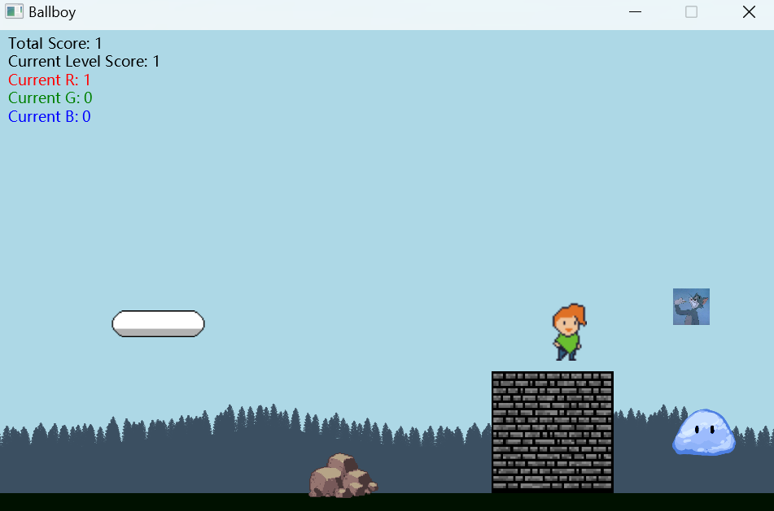

# Overview


A basic 2D classic video game ballboy written in JavaFX. Try to control your hero ballboy without colliding with the enemies, and use his pet squarecat to destroy enemies. 
**Goal:** Get through all the levels to win, and try to kill more enemies for a higher score.




# Prerequisite


The project mainly uses [Java 11](https://www.oracle.com/java/technologies/downloads/#java11) and [gradle 6](https://gradle.org/releases/) with some related plugins. You can also ues a higher version than they do. Go and check them out if you do not have them locally installed. Otherwise you will not be able to launch the project.

### Recommended modules
It is highly recommended that you use an **IDE** software like **Intelij**, which can integrate Gradle with Java and automatically loads the required plug-ins.

## Installation
Check if you have **Java 11** and **Gradle 6.9** or higher version installed on your computer. 

`$ java -version`

You should see somegthing  like this

```java version "11.0.12" 2021-07-20 LTS
Java(TM) SE Runtime Environment 18.9 (build 11.0.12+8-LTS-237)
Java HotSpot(TM) 64-Bit Server VM 18.9 (build 11.0.12+8-LTS-237, mixed mode)
```
`$ javac -version`

You should see somegthing just like this

`javac 11.0.12`  

`$ gradle -version`

You can see something like this

```
------------------------------------------------------------
Gradle 6.9
------------------------------------------------------------

Build time:   2021-05-07 07:28:53 UTC
Revision:     afe2e24ababc7b0213ccffff44970aa18035fc0e

Kotlin:       1.4.20
Groovy:       2.5.12
Ant:          Apache Ant(TM) version 1.10.9 compiled on September 27 2020
JVM:          11.0.12 (Oracle Corporation 11.0.12+8-LTS-237)
```

Java Installation: instructions could be found on https://docs.oracle.com/en/java/javase/11/install/  
Gradle Instalation: instructions could be found on https://gradle.org/install/

## Usage

You can launch the program either by typing a command line at the terminal or click the run button directly in IDE after you put the files in appropriate places.

 Firstly, initialize a gradle project on your computer
 
 `$ mkdir projectFolderName`  
 `$ cd projectFolderName`  
 `$ gradle init`  
 
 Choose "application", "java", "Groovy" and "JUnit 4"

After the init task had run, you should see the `build.gradle` file (the build.script) and `src` folder. Just replace them with those two files (build.gradle and src) from my zip package that you have downloaded, and also put the `example.json` file next to `build.gradle` file.

Then, you can run the code

 `$ cd projectFolderName`  
 `$ gradle run`

As the program is running, you should see the game window and are able to start the game. In the game, you can control the hero Ballboy's movement by continuously pressing and releasing the arrow keys. The hero keeps bouncing, but you can move left and right with the left and right keys, up key to increase jump height while down key to decrease height. When you reach the flag, you finish the level. Along the way, you need to avoid enemies, and if you touch them, the hero will return to the starting point.

Fiinally, the game window will be closed after you finish this level since only one level has been designed so far.  You could see something like this in your terminal

```
BUILD SUCCESSFUL in 50s
4 actionable tasks: 2 executed, 2 up-to-date
```

# Getting Started

#### Running

  

`gradle run`

  

#### Building

  

`gradle build`

  

#### Testing

  

`gradle test`


# Game Controls


The ballboy is controlled through the left, right and up arrow keys.
Pressing up will boost the bounce height, with a maximum bounce height being the level height.
Pressing left or right will move the entity in the given direction.
Lifting the left or right key after pressing it, without having at least one of the two keys down, will result in the bounce height being reduced.

**Quicksave and Quickload:** 
Press 's' will save the current state of the game, storing game data and the current level.
Press 'q' will restore the game state to the last saved version.


# Configuration


The level configuration is to be located in the resources directory with the name `config.json`.

  

The root level configuration consists of `currentLevelIndex', specifying which level to load from the `levels` array.

  

The following fields are necessary for the level configuration: `levelWidth`, `levelHeight`, `floor`, `levelGravity` and `maxHeroVelocityX`. An example is shown below:

``` json

"_levelWidthComment": "The actual width of the level. This will be used to enforce game boundaries",

"levelWidth": 2000.0,

"_levelHeightComment": "The actual height of the level. This will also be used to enforce game boundaries",

"levelHeight": 620.0,

"_floorComment": "The configuration of the levels floor",

"floor": {

"_heightComment": "The floor height. Dynamic entities will not be allowed below this",

"height": 600.0,

"_colorComment": "Color must be a web color, e.g. #0033cc",

"color": "#001100"

},

"_levelGravityComment": "The gravity applied to bouncing entities. This is in pixels per millisecond",

"levelGravity": 700.0,

"_maxHeroVelocityX": "The maximum horizontal velocity of the hero. This is used to provide usable game controls",

"maxHeroVelocityX": 50,

```


The generic entities for the level are configured as shown below:

``` json

"_genericEntitiesComment":"A list of all generic entities. They are generic in the sense that the level treats them as a batch, with no specific understanding or logic for each, except that enemies could have color stats, and different colors (Red, Green, Blue) have different scores.",

"_entitiesTypeComment": "options include cloud, enemy, static, boundary, background",

"genericEntities":[

{

"_typeComment":"The key used to distinguish which concrete entity type is to be instantiated inside the factory method",

"type":"cloud",

"startX":234.0,

"startY":0.1,

"_horizontalVelocityComment":"This is the horizontal velocity of the cloud",

"horizontalVelocity":-20.2,

"_imageComment":"The image to be used for the entity view. The height and width are derived from this.",

"image":"cloud_1.png"

},

{

"type":"static",

"posX":400,

"posY":565,

"_heightComment":"The width will be derived from the height and image dimensions, with the ratio being preserved.",

"height":40,

"image":"bolder.png"

},

{

"type": "enemy",

"startX": 10.0,

"startY": 550.1,

"startVelocityX": -10.0,

"height": 20.0,

"image": "slimeRa.png",

"_behaviourComment": "The possible values are aggressive, passive and scared",

"behaviour": "aggressive",

"color": "red"

},

{

"type":"background",

"posX":0.0,

"posY":400.0,

"height":200,

"image":"landscape_0000_1_trees.png"

}

]

```


The hero is configured as shown below:

```json

"hero": {

"type": "hero",

"startX": 150.0,

"startY": 300.0,

"_sizeComment": "options include small, medium, large. If not specified this field will default to normal",

"size": "large",

"image": "ch_stand2.png"

}
```


The squarecat is configured as shown below:

```json

"squarecat":{  

  "type": "squarecat",  
  
  "startX": 150.0,  
  
  "startY": 250.0,  
  
  "height": 25,  
  
  "speed": 100,  
  
  "_speedComment": "the running distance per second for the orbit movement around the hero",  
  
  "orbitEdgeLength": 200,  
  
  "_orbitEdgeLengthComment": "The side length of the square orbit",  
  
  "image": "squarecat.png"  
},
```


The finish is configured as shown below:

```json

"finish": {

"type": "finish",

"posX": 1200.0,

"posY": 520.0,

"height": 80.0,

"width": 40

}

```

The complete configuration  is stored in `config.json` in the resources directory.


### New Features

**Level transaction**
- Collide with the finish (the tree) will not end the game but moves on to the next level until all levels are finished.
- A list of levels is stored in the game engine. It starts from the current level, and when the level is passed, it checks whether there is a next level. If not, the game ends and the player is notified of the victory in the game window, which is realized by the GameVictoryDisplay class that implements InformationDisplayer interface.
- It is easy to start the game from any level by modifying the `"currentLevelIndex"` in `config.json`. The current default starting level is index 0, you can change it to 1 or 2 to start at the second level or third level. (Currently, we only have three levels configured in the file so far, but you can add more ).


**Squareccat**
- The squarecat will act as a pet moving in a square shape around the hero.
- The squarecat will protect the hero. When enemies collide with squarecat, they will be destroyed.


**Score**
- The game's score information is displayed in the upper left of the game window, different enemies with different colors has different points.
- The `Current Level Score` shows the score gained in current level.
- The `Current R` shows the score gained from red enemies in current level.
- The `Current G` shows the score gained from green enemies in current level.
- The `Current B` shows the score gained from blue enemies in current level.
- The `Total Score` shows the sum of scores gained from all levels

**Save/Load mode**
- A quicksave and quickload mode have been implemented in this game.
- The quicksave can save all the current levels, entities, scores and related states.
- Pressing 's' key will save the current state of the game, and pressing 'q' key will restore the game state to the last saved version.


# Design Patterns


## Factory Method


#### Product


See Entity in Entity.java

  
#### Concrete Products

  
- StaticEntityImpl in StaticEntityImpl.java

- DynamicEntityImpl in DynamicEntityImpl.java.

  
#### Creator

  
See EntityFactory in EntityFactory.java

  

#### Concrete Creator

  

- StaticEntityFactory in StaticEntityFactory.java

- FinishFactory in FinishFactory.java

- CloudFactory in CloudFactory.java

- EnemyFactory in EnemyFactory.java

- BallboyFactory in BallboyFactory.java
 
- SquareCatFactory in SquareCatFactory.java

  

These are registered in EntityFactoryRegistry in EntityFactoryRegistry.java, and injected in the root level App class in App.java


## Strategy Pattern

  
### 1. Entity Behaviour

  
#### Strategy

  
See BehaviourStrategy in BehaviourStrategy.java


#### ConcreteStrategy

  
- AggressiveEnemyBehaviourStrategy in AggressiveEnemyBehaviourStrategy.java

- PassiveBehaviourStrategy in PassiveBehaviourStrategy.java

- ScaredEnemyBehaviourStrategy in ScaredEnemeyBehaviourStrategy.java

- FloatingCloudBehaviourStrategy in FloatingCloudBehaviourStrategy.java

- SquareCatBehaviourStrategy in SquareCatBehaviourStrategy.java
  

#### Context


See DynamicEntityImpl in DynamicEntityImpl.java


### 2. CollisionResolution

  
#### Strategy

  
See CollisionStrategy in CollisionStrategy.java

  
#### ConcreteStrategy

  
- BallboyCollisionStrategy in BallboyCollisionStrategy.java

- EnemyCollisionStrategy in EnemyCollisionStrategy.java

- PassiveCollisionStrategy in PassiveCollisionStrategy.java

  
#### Context

  
See DynamicEntityImpl in DynamicEntityImpl.java

  
## Observer Pattern


#### Subject


See Subject in Subject.java

  
#### Concrete Subject

  
- LevelImpl in LevelImpl.java

- GameEngineImpl in GameEngineImpl.java.

  
#### Observer

  
See Observer in Observer.java

  

#### Concrete Observer


- RedScoreObserver in RedScoreObserver.java

- GreenScoreObserver in GreenScoreObserver.java

- BlueScoreObserver in BlueScoreObserver.java

- LevelScoreObserver in LevelScoreObserver.java

- TotalScoreObserver in TotalScoreObserver.java


## Memento Pattern


#### Memento


See GameMemento in GameMemento.java

  
#### Originator

  
See GameEngineImpl in GameEngineImpl.java.


#### CareTaker


See MementoStore in MementoStore.java


# Contributing


### Current contributors
- Soft9201 staff (Original code base)
- Renjie He (Code extension)

If you would like to make improvements to the project, please contact us for permission to contribute. Feel free to dive in!
